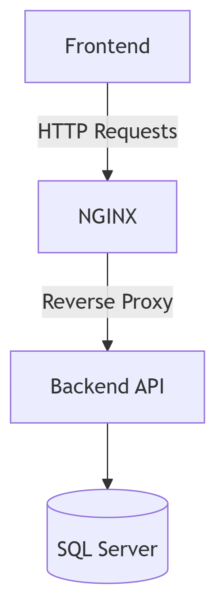
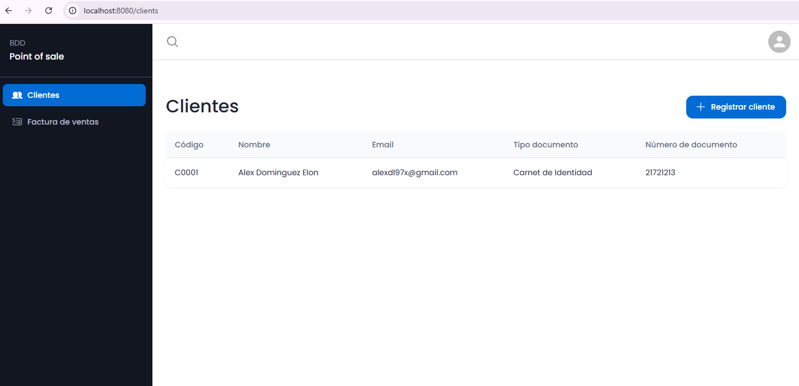
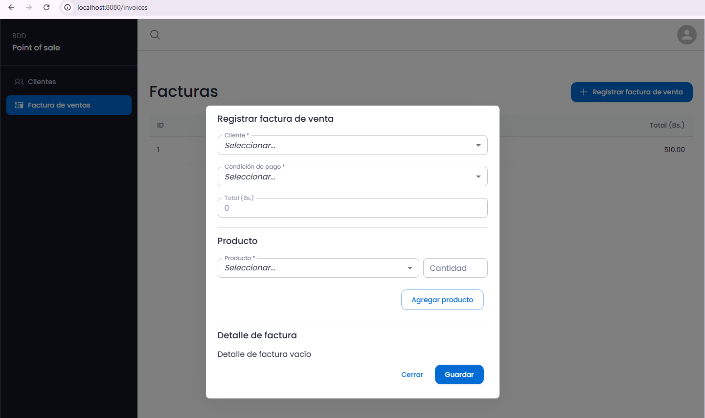

# POS System - SolidProducts (FullStack)
## 🌟 Descripción
Sistema completo **Point of Sale (POS)** con:
- **Backend:** API REST en .NET 8 para gestión de productos/ventas
- **Frontend:** Aplicación React/Vite con TypeScript
- **Infraestructura:** NGINX como proxy inverso y servidor web

## 📊 Diagrama del Sistema
<div align="center">
  
</div>

## 👥 Página de Clientes
<div align="center">
  
</div>

## 💰 Página de Ventas
<div align="center">
  
</div>

## 🚀 Tecnologías utilizadas
### Backend
- **.NET 8** (ASP.NET Core Web API)
- **C#**
- **SQL Server 2022**
- **nginx** (como proxy inverso)

### Frontend
- **Vite**: Bundler rápido para desarrollo moderno.
- **TypeScript**: Tipado estático para JavaScript.
- **ESLint**: Estándares de calidad y consistencia de código.
- **Node.js & npm**: Gestión de dependencias.

## 📦 Prerrequisitos
### Backend
Antes de instalar y ejecutar el proyecto, asegúrate de contar con:
- [SDK de .NET 8](https://dotnet.microsoft.com/en-us/download/dotnet/8.0)
- [SQL Server 2022 Developer o Express](https://www.microsoft.com/en-us/sql-server/sql-server-downloads)
- [nginx para Windows](https://nginx.org/en/download.html)
<!-- - Puerto **80** (o el configurado en nginx) libre -->
<!-- - Puerto **1433** (SQL Server) libre -->
<!-- - Al menos **2 GB** de memoria disponible -->

### Frontend
Antes de iniciar, asegúrate de tener instalado:

- [Node.js](https://nodejs.org/) — Versión recomendada: **22.x**
- npm — Incluido con la instalación de Node.js

## ⚙️ Instalación
### Backend
1. **Clonar el repositorio**
   ```bash
   git clone https://github.com/GenaroAlvarez/mdeis-m8-devops-backend.git
   cd mdeis-m8-devops-backend/mdeis-m8-devops-backend
   ```

2. **Restaurar dependencias**
   ```bash
   dotnet restore
   ```

3. **Configurar cadena de conexión**
   Edita el archivo `appsettings.json`:
   ```json
   {
     "ConnectionStrings": {
       "DefaultConnection": "Server=localhost;Database=products;User Id=sa;Password=TU_PASSWORD;TrustServerCertificate=True;Encrypt=False;"
     }
   }
   ```

### Frontend
1. **Clonar el repositorio**
  ```bash
  git clone https://github.com/GenaroAlvarez/mdeis-m8-devops-backend.git
  cd mdeis-m8-devops-backend/mdeis-m8-devops-frontend
  ```

2. **Instalar dependencias**
  ```bash
  npm install
  ```
3. **Ejecución en entorno local**
  Para desarrollo:
  ```bash
  npm run dev
  ```

## 🚀 Despliegue
### Backend
#### 1. Publicar el proyecto
Genera la versión lista para producción:
```bash
dotnet publish -c Release -o ./publish
```
Esto creará los archivos en la carpeta `publish`.

#### 2. Configurar nginx
Edita el archivo `nginx.conf` para agregar el proxy inverso:
```nginx
server {
    listen 80;

    location / {
        proxy_pass         http://localhost:5000;
        proxy_http_version 1.1;
        proxy_set_header   Upgrade $http_upgrade;
        proxy_set_header   Connection keep-alive;
        proxy_set_header   Host $host;
        proxy_cache_bypass $http_upgrade;
        proxy_set_header   X-Forwarded-For $proxy_add_x_forwarded_for;
        proxy_set_header   X-Forwarded-Proto $scheme;
    }
}
```

#### 3. Ejecutar la API
Inicia la API publicada desde la carpeta `publish`:
```bash
dotnet SolidProducts.dll --urls "http://localhost:5000"
```

#### 4. Iniciar nginx
Ejecuta `nginx.exe` desde su carpeta de instalación:
```bash
start nginx
```

#### 5. Ejecuta el script de datos
Ejecuta el script `inserts.sql` para llenar datos iniciales.

Ahora tu API estará accesible en:
```
http://localhost
```

Para validar funcionamiento, ingresa a la siguiente URL:
```
http://localhost/api/v1/products
```
### Frontend
#### 1. Construcción del Proyecto
Genera los archivos estáticos para producción ejecutando:

```bash
npm run build
```

#### 2. Configurar el directorio en NGINX
- Navega hacia el directorio `../nginx/html` y crear el directorio `grupo5-frontend`
- Mueve todos los archivos del directorio `../mdeis-m8-devops-frontend/dist/` hacia el nuevo directorio `grupo5-frontend`

#### 3. Configurar NGINX
Ingresa al archivo `../nginx/conf/nginx.conf` y agrega este bloque de configuración:
```
    server {
        listen       8080;
        server_name  localhost;

        root   "<PATH_NGINX>/html/grupo5-frontend"; # camia PATH_NGINX por la ruta donde se encuentra el directorio nginx
        index  index.html;

        location / {
            try_files $uri $uri/ /index.html;
        }
    }
```

#### 4: Reiniciar NGNIX
Ejecuta los comandos en el CMD (como administrador):
1. Recargar la configuración
```
nginx -t          # Verifica que la sintaxis sea correcta
nginx -s reload   # Recarga la configuración
```
2. Detener Nginx (si está en ejecución)
```
nginx -s stop
```

3. Iniciar Nginx (nueva instancia)
```
start nginx
```
o usando el comando como servicio:
```
net stop nginx
net start nginx
```

#### 5: Accede a la aplicación
La aplicación estará disponible en:
```
http://localhost:8080
```